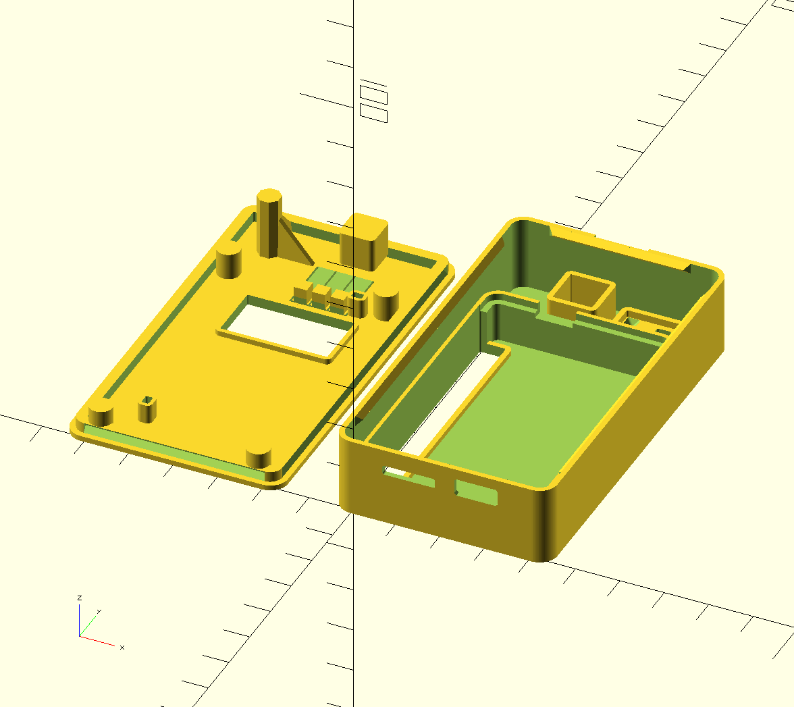
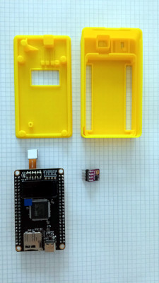
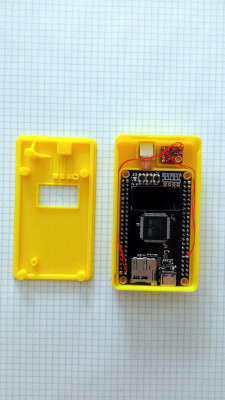
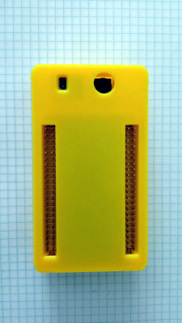
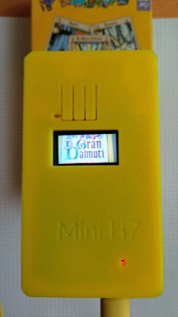

# Box for WeAct MiniSTM32H7xx
|  |  |
|--|--|
| open | assembled|

| | | | |

This is a box for the [WeAct-TC MiniSTM32H7xx](MiniSTM32H7xx.jpg) board. The MiniSTM32H7xx runs micropython and openmv (Open Machine Vision). The board includes a camera and lcd screen.

Additionally, there is room to mount a [GY-530](GY-530.jpg) board, a VL53L0X time-of-flight laser range finder. This distance sensor can be used to check whether there is something in front of the lens. 

Connections:

|VL53L0X|MiniSTM32H7xx|
|---|---|
|Vin|3V3|
|GND|GND|
|SCL|D12|
|SDA|D13|

## Download

[STL files](https://github.com/koendv/weact-mini-stm32h7xx-box/releases) for 3D printer. The box consists of two parts, a top and a bottom. There are two versions of the bottom, one with DuPont connectors exposed and one with DuPont connectors covered.

## Hardware

Notes about the WeAct-TC MiniSTM32H7xx camera hardware I'm using with OpenMV.

- [camera](https://www.aliexpress.com/item/1005001475058305.html) with lcd screen. Runs micropython.
- Installation [manual](https://github.com/WeActTC/MiniSTM32H7xx)
- How to [install the lcd](https://m.bilibili.com/video/av286164536)
- camera [firmware](https://gitee.com/WeAct-TC/MiniSTM32H7xx/tree/master/SDK/openmv/Firmwares/)
- [tool](https://gitee.com/WeAct-TC/MiniSTM32H7xx/tree/master/Soft) to upload firmware to the camera
- [openmv ide](https://github.com/koendv/openmv-ide-raspberrypi) for raspberry pi
- [VL53L0X](https://github.com/ramithuh/OpenMV-VL53L0X) laser distance sensor to check whether there is something in front of the camera

## OpenSCAD notes

This 3D model was made as follows:

- Download [3D model of MiniSTM32H7xx](https://github.com/WeActTC/MiniSTM32H7xx) pcb from WeAct git.
- Convert 3D model to stl with FreeCAD
- Extract 3D models of buttons, leds, connectors, pcb to stl with FreeCAD
- Download [3D model of GY-530](https://www.thingiverse.com/thing:2558558) from Thingiverse
- Import 3D models in OpenSCAD
- Use 3D models of leds, buttons and connectors as guides for holes in enclosure

*not truncated*
