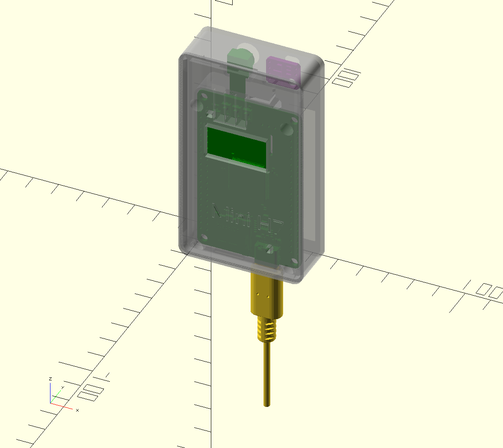

# Box for WeAct MiniSTM32H7xx
|  |  |
|--|--|
| open | assembled|

 

This is a box for the WeAct-TC MiniSTM32H7xx board.

## Download

[STL file](https://github.com/koendv/weact-mini-stm32h7xx-box/releases) for 3D printer.

## Hardware

Notes about the WeAct-TC MiniSTM32H7xx camera hardware I'm using with OpenMV.

- [camera](https://www.aliexpress.com/item/1005001475058305.html) with lcd screen. Runs micropython.
- Installation [manual](https://github.com/WeActTC/MiniSTM32H7xx)
- How to [install the lcd](https://m.bilibili.com/video/av286164536)
- camera [firmware](https://gitee.com/WeAct-TC/MiniSTM32H7xx/tree/master/SDK/openmv/Firmwares/)
- [tool](https://gitee.com/WeAct-TC/MiniSTM32H7xx/tree/master/Soft) to upload firmware to the camera
- [openmv ide](https://github.com/koendv/openmv-ide-raspberrypi) for raspberry pi

## OpenSCAD notes

This 3D model was made as follows:

- Download 3D model of pcb from WeAct git.
- Convert 3D model to stl with FreeCAD
- Extract 3D models of buttons, leds, connectors, pcb to stl with FreeCAD
- Import 3D models in OpenSCAD
- Use 3D models of leds, buttons and connectors as guides for holes in enclosure

*not truncated*